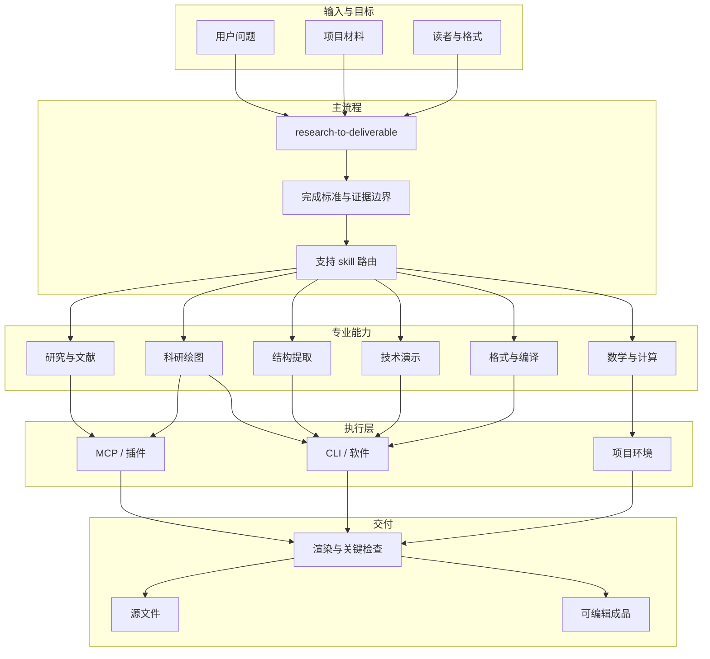

# Architecture

```mermaid
flowchart TB
    subgraph input[输入与目标]
      A[用户问题]
      B[项目材料]
      C[读者与格式]
    end
    subgraph orchestration[主流程]
      D[research-to-deliverable]
      E[完成标准与证据边界]
      F[支持 skill 路由]
    end
    subgraph capabilities[专业能力]
      G[研究与文献]
      H[数学与计算]
      I[科研绘图]
      J[结构提取]
      K[技术演示]
      L[格式与编译]
    end
    subgraph execution[执行层]
      M[MCP / 插件]
      N[CLI / 软件]
      O[项目环境]
    end
    subgraph output[交付]
      P[源文件]
      Q[可编辑成品]
      R[渲染与关键检查]
    end
    A --> D
    B --> D
    C --> D
    D --> E --> F
    F --> G
    F --> H
    F --> I
    F --> J
    F --> K
    F --> L
    G --> M
    H --> O
    I --> N
    I --> M
    J --> N
    K --> N
    L --> N
    M --> R
    N --> R
    O --> R
    R --> P
    R --> Q
```

主流程维护共同前提和整合；专业 skill 维护领域方法；工具和插件负责真实执行。
